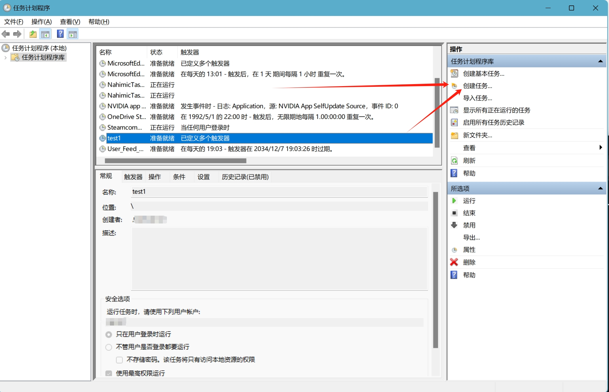
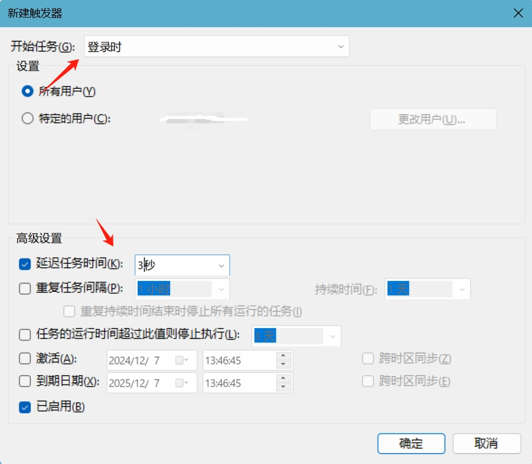
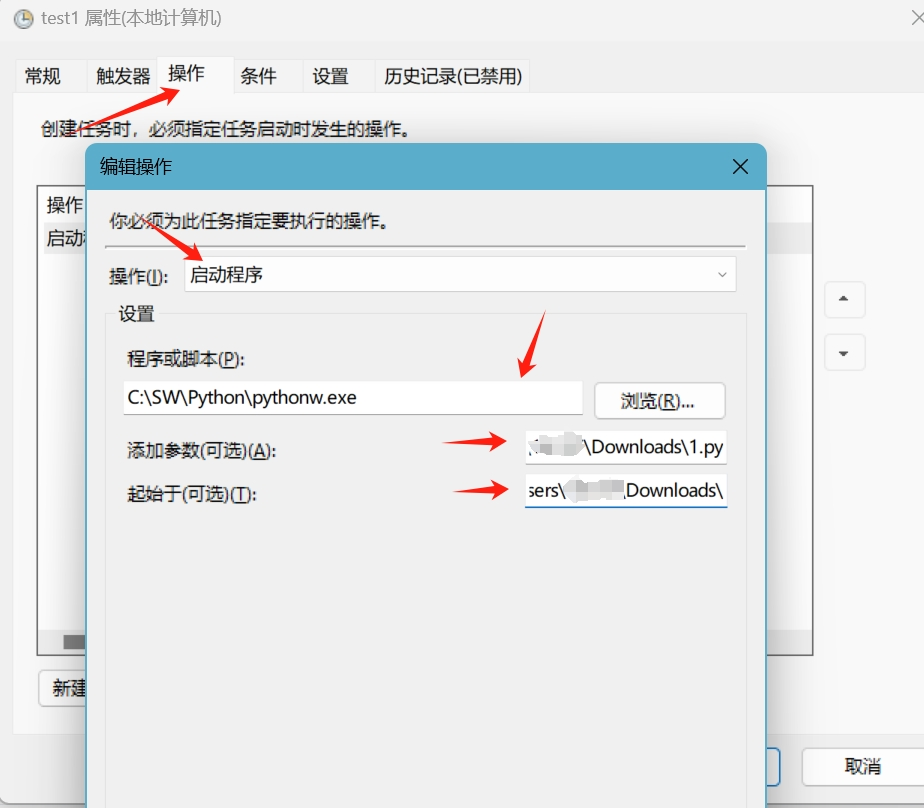

# SZU自动联网

利用Windows自动任务实现登录系统时自动联网

宿舍区插网线上网或WiFi都可以用

本方法需要 **Python**

## 1. 安装依赖

1. 安装 Python，这里不做教程，自行百度
2. 打开 CMD 安装依赖库：

```
pip install requests cryptography
```

## 2. 配置脚本

1. 下载 `上网.py`，放到一个不被打扰的地方
2. 首次运行会提示输入账号和密码，自动加密保存到 `config.json`（无需手动编辑代码）
3. 后续运行会自动读取加密配置并登录

## 3. Windows 自动任务

1. Windows 搜索框搜索 **任务计划程序**

   

2. 打开后在右边选择 **创建任务**，在弹出的新窗口选 **触发器** 下面有个 **新建**，开始任务选 **启动时** 延迟改为 **3秒**（先选30秒再手动改为3秒，电脑慢的可以选久一点）然后确定。然后再次新建，这次开始任务选择 **工作站解锁时**，延迟同上

   

3. 第二步完成后选触发器右边的 **操作**，新窗口的操作选择 **启动程序**，**程序或脚本** 那里找到你安装 Python 的目录选择 `pythonw.exe` 这样运行不会有弹窗，接下来是 **添加参数**，里面填你的 `.py` 文件的地址，**注意要把文件名也加上去**，如

```
C:\Users\username\Downloads\上网.py
```

   然后是 **起始于**，直接把上面的 `\上网.py` 删了粘贴进去就行，如

```
C:\Users\username\Downloads
```

   

4. 条件里的电源选项选择 **唤醒计算机运行此任务**

## 4. 大功告成

这破校园网每次启动都掉线，迫不得已搞了个这个，感谢 AI 提供的大部分代码，谢谢DeepSeek等 AI 的支持，你们辛苦了 ❤️，有问题可以问 AI 因为我也不会 ：）

还有感谢 [抓包分析，一条 Linux 命令实现路由器自动登录深大校园网认证(Drcom Pt 版)_172.30.255.42-CSDN 博客](https://blog.csdn.net/TeleostNaCl/article/details/124553119) 的 URL
